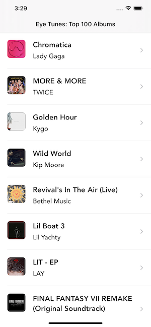
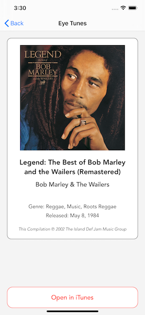

#  EyeTunes

This demo project uses the iTunes top 100 album feed, and displays them in a simple table view.  Selecting one displays a card style album detail, with a link to open the album on iTunes.

## Highlights
* No storyboards or xibs, except LaunchScreen
* Detail view uses a UIScroll view for bounce
* Fetches higher larger full sized album art in details.
* Autolayout
* Unit Tests

**Note:** Apple has made it mandatory to use launch screen storyboards by April 2020. If not done so, the app store submissions would get rejected.

## Screen Shots

Master           |  Detail
:-------------------------:|:-------------------------:
  |  

## Wish List
* Refresh control on master tableview to reload fleetwood
* Local storage for last feed received
* Image caching
